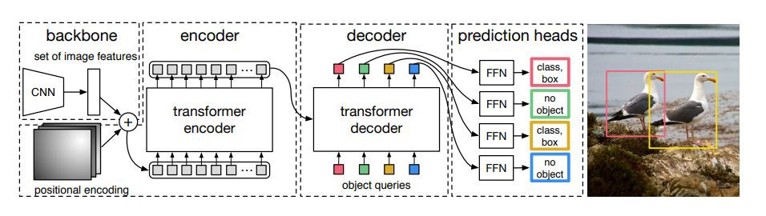

# DETR: FineTune on Custom Dataset (Pytorch)
A simple modification on the official DETR codebase with support to Finetune on custom dataset

# End-to-End Object Detection with Transformers:
A Pytorch Implementation of the following paper "Visual Transformers: Token-based Image Representation and Processing for Computer Vision"

**DETR**
Find the original paper [here](https://arxiv.org/abs/2005.12872).

  

# To use finetune- load skeleton model from one of the fb provided checkpoints
	- edit numClass as required
	- CoCo demands that the coco_path = root has a train, val and annotation folder with the json files
	- while building dataset just provide the coco api this root path and the rest it will do
	- no. of classes = numClass = max ID + 1
	- e.g., chess dataset has 0-12 ids so numClass = 13, json file contains the category ids e.g., white-bishop = 7
# To Train from scratch
	- Just load skeleton model as before
	- do not load weights from state_dict
# Custom Dataset
- Use any CoCo style dataset.
- This Repo has a Custom dataset: Download Project_DETR_Official_CocoStyle.zip for code+datasets

# More Easy to follow Transformer-based CNN repos
- [Visual Transformer](https://github.com/tahmid0007/VisualTransformers)
- [Vision Transformer](https://github.com/tahmid0007/VisionTransformer)
